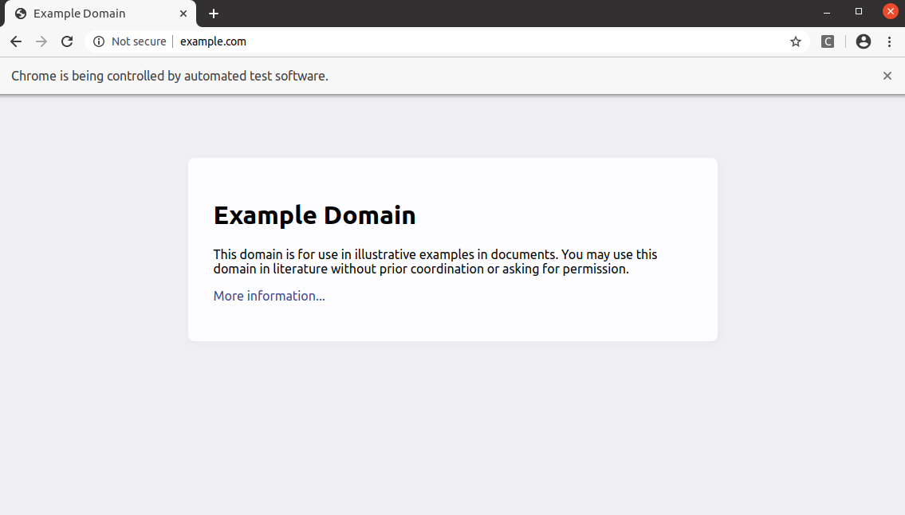

# New Relic Synthetics Workspace Generator
The New Relic Synthetics Workspace Generator is a Yeoman generator that helps you set up a development and testing environment for New Relic Synthetics Scripted Browser and API tests. It provides a streamlined workflow for creating, managing, and running your Synthetics scripts locally.

## Features

* Generate a workspace for developing and testing New Relic Synthetics scripts
*  Download and upload Synthetics scripts to your New Relic account
*  Run Synthetics scripts locally for debugging and testing
*  Manage Synthetics monitors (create, delete, update settings)
*  Examples and templates for Scripted Browser and API tests


## Prerequisites
* Node.js
* Git CLI (optional, for local repo)


## Getting Started

1. Install Yeoman and generator-nrsynthetics-workspace globally:
```
  
  npm install -g yo
  npm install -g @tanben/generator-nrsynthetics-workspace 
```

2. Generate your new Synthetics workspace:
```
yo @tanben/nrsynthetics-workspace
```
3. Follow the prompts to configure your workspace and connect it to your New Relic account.
4. Once the workspace is generated, navigate to the synthetics-local directory:
```
cd synthetics-local
```

## Generating a NR Synthetics workspace

1. Run `yo @tanben/nrsynthetics-workspace` from commandline

2. Select `Yes` (default) when prompted `? Enable Download/Upload of Synthetics scripts to your account?`

3. Enter your Admin API Key when prompted, if you answered `Yes` from step-1.

```
This generator can also be run with: yo @tanben/nrsynthetics-workspace


     _-----_     ╭──────────────────────────╮
    |       |    │      Welcome to the      │
    |--(o)--|    │   bedazzling Synthetics  │
   `---------´   │        generator!        │
    ( _´U`_ )    ╰──────────────────────────╯
    /___A___\   /
     |  ~  |
   __'.___.'__
 ´   `  |° ´ Y `

? Enable Download/Upload of Synthetics scripts to your account? Yes
? Enter your admin Api Key NRAA-XXXXXXXXXXXXXXXXXXXXXXXXXXX
? Initialize local Git repo? Yes

```
A workspace is created called `synthetics-local`, the admin key will be stored in `.nrconfig.json`.

Note: A local repo is setup for you, which would allow you to track and manage your local changes. To configure your local Git repo see [Customizing Git Configuration](https://git-scm.com/book/en/v2/Customizing-Git-Git-Configuration).


#### Files
```
./synthetics-local
|
|── .vscode
|    ├── launch.json
|
├── apps
│   ├── deleteScripts.js
│   ├── downloadConfig.js
│   ├── downloadScripts.js
│   ├── listLocalScripts.js
│   └── updateSettings.js
│   └── uploadLocalScripts.js
│   └── uploadScripts.js
|
├── examples
│   ├── apiTest.js
│   └── scriptedBrowser.js
├── lib
│   ├── simulator.js  // mock New Relic Synthetics implicit objects
|
├── LICENSE
├── monitors            // created after downloading a monitor
│   ├── nr-monitor.json // holds the account monitor configurations
│   └── scriptedBrowser-test1.js // downloaded script
|
├── package.json
└── package-lock.json

```
#### Verify local repo

```
btan@local:~//synthetics-local$ git status
On branch master

No commits yet

Untracked files:
  (use "git add <file>..." to include in what will be committed)
	.editorconfig
	.gitignore
	.vscode/
	LICENSE
	README.md
	apps/
	examples/
	lib/
	monitors/
	package-lock.json
	package.json
```
**Note:** The admin key is stored in `.nrconfig.json` and is not commited see `.gitignore`


## Download / Upload & Manage monitor
**Note:**  This option is only avaiabable if you opted  `Yes`  to **Enable Download/Upload of Synthetics scripts.**


1. Change directory into `synthetics-local` .
2. Download monitor by running this command: `npm run download`; to upload `npm run upload`. You can also run any of the following commands:
- To create a monitor: `npm run create`
- To delete a monitor: `npm run delete`
- To update a monitor's settings: `npm run update:settings`
3. You will be presented with a list for Scripted Browser and API test.
   You can select single or multiple monitors or select `ALL`.

```
> npm run download

Using apiKey: "XXXX-XXXXXXXXXXXXXXXXXXXXXXXXX"
? Select Monitors (Press <space> to select, <a> to toggle all, <i> to invert selection)
❯ ◯ ALL
   = Scripted Browsers =
  ◯ scriptedBrowser-test1
  ◯ scriptedBrowser-test2
   = API Tests =
  ◯ apiTest-test1
  ◯ apiTest-test2

```
Files are downloaded to `./monitors` directory which also includes the Synthetics monitor configurations for your arccount, these are saved in `nr-monitor.json`.

**NOTE:**  Do not rename the monitor file name(s) or update the configuration file.


## Running  script locally

1. Add this to the top of your script, the library mimcs the Synthetics API and implements most common commands in Synthetics.

> It's important that `global._isApiTest` is set to `false`, for scripted browser tests.

```

    if (typeof $env === "undefined" || $env === null) {
      global._isApiTest = true;  // false, for Scripted Browser
      require("../lib/simulator");
    }
```
2. Execute the script by hitting *F5* from VScode or open a terminal, run `node <filename>.js` in the `./monitors`  directory.
```
monitors>  node <filename>.js
```

## Running Examples
### API Test
Open the file examples/apiTest.js and `F5` to execute.

Go to troubleshooting section if you received an error:
> Can't find Node.js binary "node": path does not exist. Make sure Node.js is installed and in your PATH, or set the "runtimeExecutable" in your launch.json

```
btan@local:~/synthetics-local$ node examples/apiTest.js
Response: { widgetCount: 10, widgetType: 'gear' }

```
### Scripted Browser
Open the file examples/apiTest.js and `F5` to execute.

Go to troubleshooting section if you received an error:
> Can't find Node.js binary "node": path does not exist. Make sure Node.js is installed and in your PATH, or set the "runtimeExecutable" in your launch.json

```
btan@local:~/synthetics-local$ node examples/scriptedBrowser.js

```
Browser opens



## Troubelshooting
### Error Message

#### TypeError: $browser.get is not a function. When running scripted browsers.
> Make sure that you've set:  `global._isApiTest = false`

#### Can't find Node.js binary "node": path does not exist. Make sure Node.js is installed and in your PATH, or set the "runtimeExecutable" in your launch.json

> Edit the file `.vscode/launch.json` , and add the "runtimeExecutable" property with the Node path:
```
      "runtimeExecutable": "<Node binary absolute path>",
```
Example:
```
  {
  "version": "0.2.0",
  "configurations": [
    {
      "type": "node",
      "request": "launch",
      "name": "Launch Program",
      "skipFiles": ["<node_internals>/**"],
      "runtimeExecutable": "/Users/btan/.nvm/versions/node/v12.13.0/bin/node",
      "program": "${file}"
    }
  ]
}
```

## License

Apache-2.0
